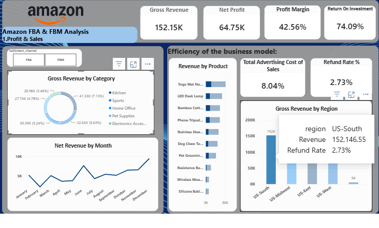
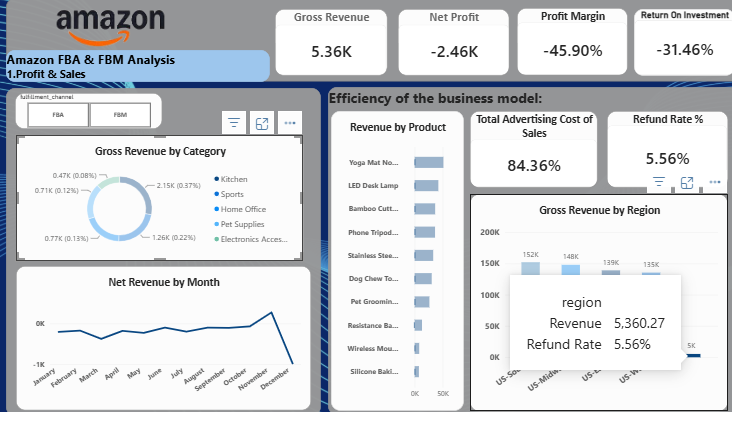
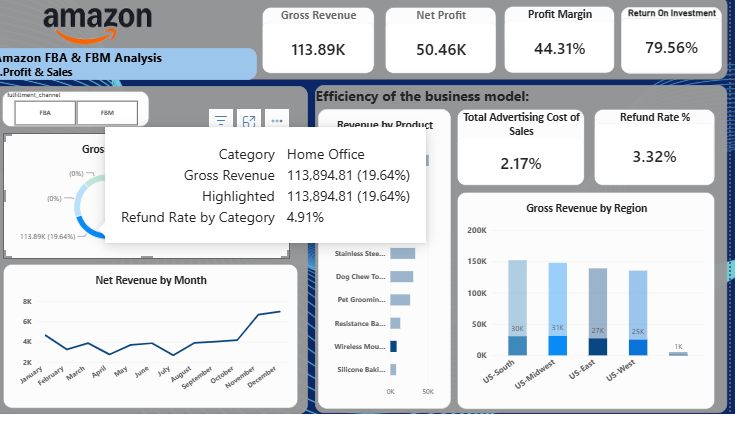
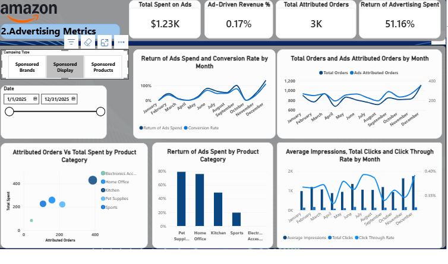
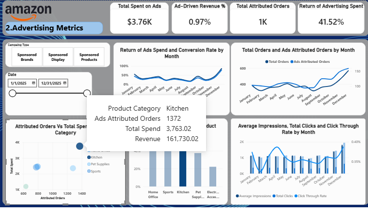
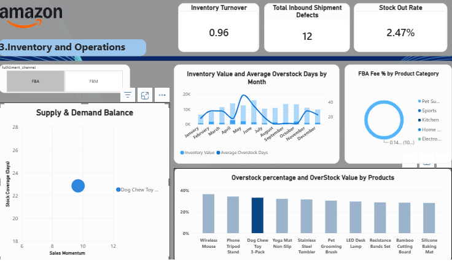
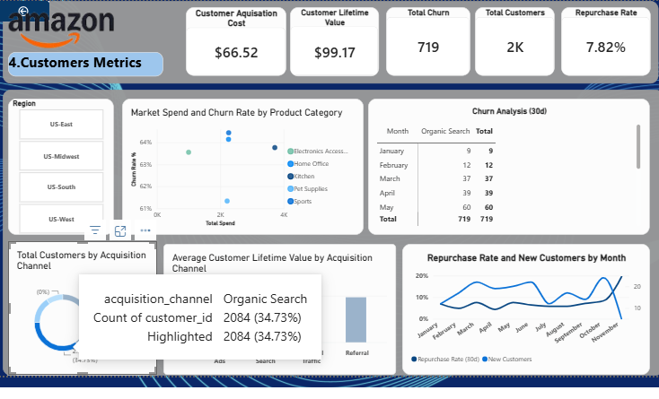

# Amazon FBA & FBM Seller Analytics Dashboard

An end-to-end analytics project simulating a multi-category Amazon storefront — synthetic dataset generation, a 4-page Power BI dashboard, and supporting business documentation (problem statement, executive summary, data dictionary).

Built to answer one question a business owner actually cares about: **is the business making money, and where is it leaking?**

---

##  Live Deliverables

| Document | Purpose |
|---|---|
| [`docs/problem_statement.pdf`](docs/problem_statement.pdf) | The business questions this dashboard is built to answer |
| [`docs/executive_summary.pdf`](docs/executive_summary.pdf) | Leadership-facing findings and recommendations |
| [`docs/data_dictionary.md`](docs/data_dictionary.md) | Every field and calculated measure, defined |

---

##  The Business Problem

The store generated **$579.98K** in gross revenue and a **49.26%** net profit margin in FY2025. On paper that looks healthy — but profit and revenue alone can't tell you *where* money is being made, *where* it's leaking, or whether the customer base being built today will still be profitable next year.

This dashboard breaks the business into four lenses, each built around a single question:

1. **Profit & Sales** — Is the business actually making money once every cost is accounted for?
2. **Advertising / PPC** — Is every ad dollar spent recovering more than it costs?
3. **Inventory & Operations** — Will we stock out, or are we sitting on dead cash?
4. **Customers** — Is the customer base we're building actually worth what it costs to acquire?

Full detail: [`docs/problem_statement.pdf`](docs/problem_statement.pdf)

---

##  Dashboard Pages

### 1. Profit & Sales


Gross revenue, net profit, margin, and ROI at the top, with drill-down by category, product, region, and month. Supports cross-filtering — e.g. clicking a category updates refund rate and revenue-by-region simultaneously.

<details>
<summary>Drill-through examples</summary>

Filtered to **Home Office**: $113.89K gross revenue, 44.31% margin, 3.32% refund rate — but a 4.91% refund rate specifically within that category once isolated.


Filtered to **US-West** (the underperforming region): revenue drops to $5.36K with a **-45.90% margin** — this region is currently losing money, not just underperforming.


</details>

**Key measures:** Gross Revenue, Net Profit, Profit Margin %, TACOS, Refund Rate %, Revenue by Category/Product/Region.

### 2. Advertising / PPC


Total spend, ad-driven revenue share, attributed orders, and return on ad spend, broken out by campaign type (Sponsored Products / Brands / Display) with a date range slicer.

<details>
<summary>Drill-through examples</summary>

Filtered to **Sponsored Brands**: $3.76K spend, only 0.97% ad-driven revenue share, but a strong 41.52% return — small spend, efficient return.


Filtered to **Sponsored Display**: $1.23K spend, 51.16% return — the highest-performing campaign type by return, despite the smallest budget.


</details>

**Key measures:** Total Ad Spend, ACOS, ROAS, CTR, CVR, Ad-Driven Revenue %, Return of Ad Spend by Category.

### 3. Inventory & Operations


Inventory turnover, stockout rate, inbound shipment defects, and an overstock/FBA-fee breakdown by product, plus a Supply & Demand Balance scatter (stock coverage days vs. sales momentum) to flag SKUs that are over- or under-stocked relative to how fast they're selling.

<details>
<summary>Drill-through examples</summary>

Filtered to **Phone Tripod Stand**: turnover falls to 0.43, with a 34.25% overstock rate and $1,026.60 tied up in excess stock — a clear candidate to cut the next reorder quantity.


</details>

**Key measures:** Inventory Turnover, Days of Supply, Stockout Rate %, Overstock %, FBA Fee % by Category, Inbound Shipment Defects.

### 4. Customers


Customer Acquisition Cost, Customer Lifetime Value, churn, total customers, and repurchase rate, with a monthly churn table broken out by acquisition channel and a CLV-by-channel comparison.

**Key measures:** CAC, CLV, Repurchase Rate, Churn Rate (30-day), Total Customers by Acquisition Channel.

---

##  Key Insights (current build)

- **CLV now exceeds CAC** ($96.66 vs. $66.52, a 1.45:1 ratio) — a healthy direction, though still below the commonly-used 3:1 benchmark for a sustainable acquisition model.
- **US-West is currently unprofitable**, not just underperforming: -45.90% margin on $5.36K revenue, versus $135K–$152K and 40%+ margins in the other three regions.
- **Repurchase rate is low (6.98%)** relative to total customer count (6K) — retention, not acquisition, is the more actionable lever right now.
- **Sponsored Display has the highest return of any campaign type (51.16%)** despite the smallest budget — a candidate for reallocated ad spend.
- **Several SKUs (Phone Tripod Stand, Wireless Mouse) are meaningfully overstocked**, tying up cash without matching sales velocity.

Full breakdown with recommendations: [`docs/executive_summary.pdf`](docs/executive_summary.pdf)

---

##  Tech Stack

- **Power BI Desktop** — dashboard, DAX measures, drill-through, cross-filtering, slicers
- **Python** (pandas, numpy) — synthetic dataset generation (`generate_data.py`)
- **ReportLab** — PDF generation for the problem statement and executive summary

---

##  Data Model

Star-schema style model with `orders` as the primary fact table:

```
sku_catalog ──┐
              ├──< orders (fact) >── customers
inventory_daily ─┘        │
ads_daily ─────────────────┘
search_terms
reviews_weekly
```

Full field-level definitions: [`docs/data_dictionary.md`](docs/data_dictionary.md)

---

##  Repository Structure

```
├── data/
│   ├── orders.csv
│   ├── customers.csv
│   ├── ads_daily.csv
│   ├── search_terms.csv
│   ├── inventory_daily.csv
│   ├── reviews_weekly.csv
│   └── sku_catalog.csv
├── dashboard/
│   └── amazon_fba_fbm_dashboard.pbix
├── screenshots/
│   ├── profit_1.png, profit_2.png, profit_3.png
│   ├── ads_1.png, ads_2.png
│   ├── inventory_1.png, inventory_2.png
│   └── customers_1.png
├── docs/
│   ├── problem_statement.pdf
│   ├── executive_summary.pdf
│   └── data_dictionary.md
├── generate_data.py
└── README.md
```

---

##  How to Reproduce

1. Clone the repo.
2. Run the dataset generator:
   ```bash
   pip install pandas numpy
   python generate_data.py
   ```
   This regenerates all 7 CSVs in `data/`.
3. Open `dashboard/amazon_fba_fbm_dashboard.pbix` in Power BI Desktop and refresh the data source to point at your local `data/` folder.

---

##  Known Issues / Debugging Log

Documenting this because it's a more honest and more useful record than pretending the first version was correct:

- **CAC/CLV measure (fixed):** An earlier build showed CLV ($30.97) *below* CAC ($66.52) — a business-critical red flag. Root cause: the CLV measure was summing revenue across the full unfiltered customer table rather than using per-customer average revenue in the correct filter context. Corrected using `CALCULATE` with explicit row context per `customer_id`, after which CLV corrected to $96.66. **Takeaway:** always sanity-check a ratio metric against its two inputs independently before trusting the combined KPI card.
- **Inventory Value (fixed in an earlier pass):** A `SUMX` over the full `inventory_daily` fact table was summing 365 daily snapshots instead of filtering to a single date, inflating total inventory value by roughly 365x. Fixed with `CALCULATE(..., inventory_daily[date] = MAX(inventory_daily[date]))`.

## 📌 Limitations

- Ad spend is only mapped to campaign type, not to the four customer acquisition channels shown in the Customers page — a real store would need a joined attribution table to calculate CAC by channel precisely.

---

## Author

Built as a portfolio analytics project demonstrating end-to-end e-commerce data work: synthetic data generation, dashboard design, DAX measure design, and business-facing documentation.
